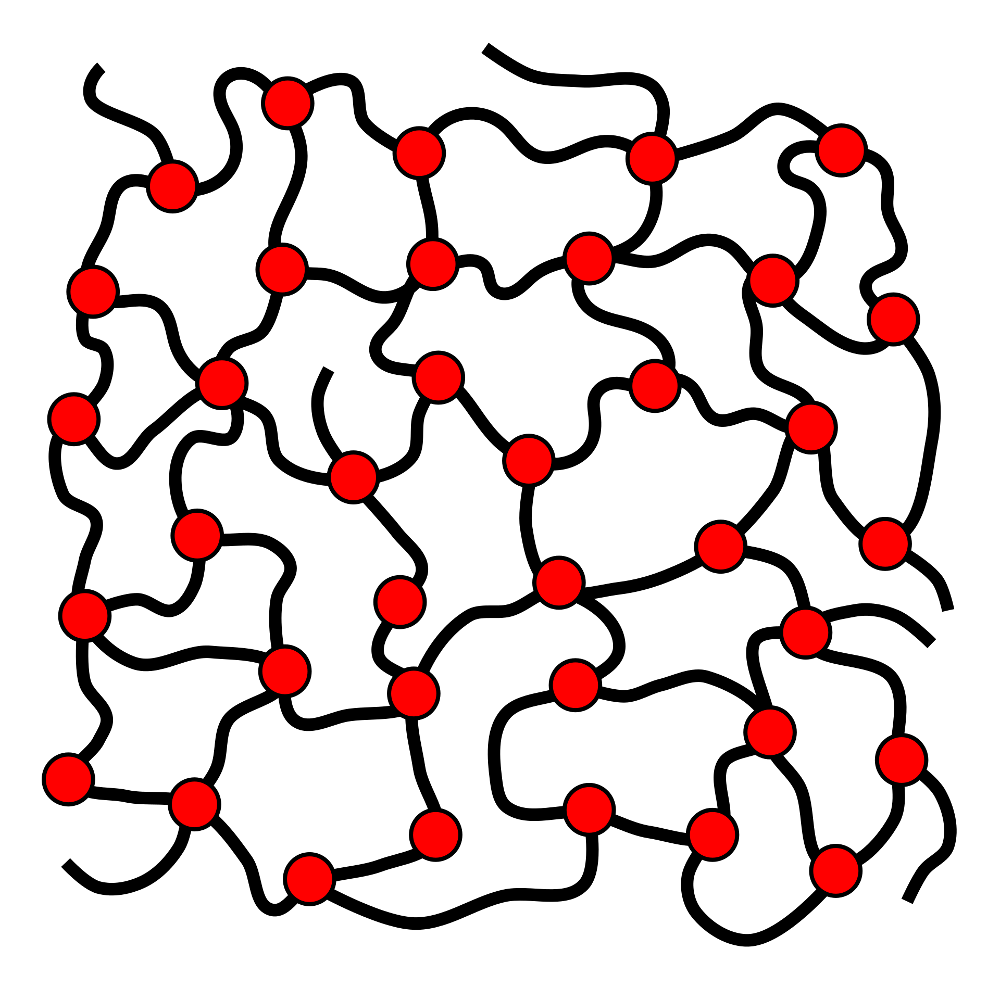
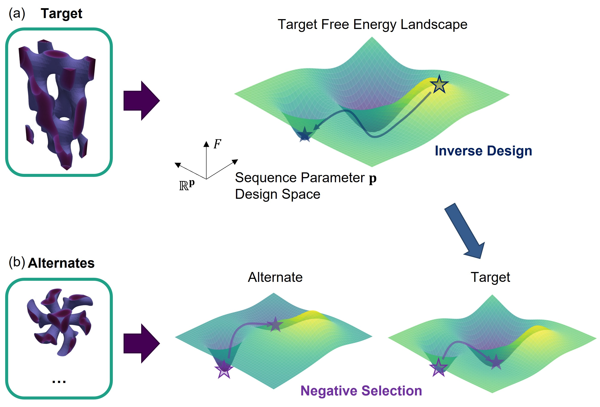
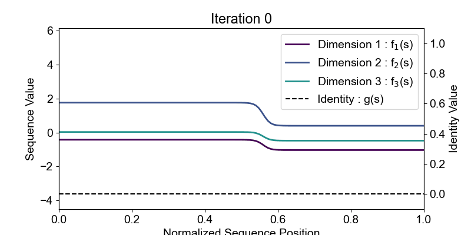

# Learning Nature's Assembly Language with Polymers 

<div align="center" style="display: flex; justify-content: center; align-items: center;">
	</img>
</div>


This is the official repository for the paper [**_Learning Nature's Assembly Language with Polymers_**](link_to_paper_coming_soon).

The self-assembly of matter into ordered structures is ubiquitous throughout nature and engineered systems, and controlled by the universal thermodynamic balance between entropy and enthalpy. Programming a material’s macroscopic properties via molecular-level control is a grand scientific challenge. One system that would benefit from targeted design are block copolymer melts which microphase-separate into ordered structures. Self-consistent field-theory (SCFT) has proven to be a robust thermodynamic model in explaining the experimental results. Yet so far only the forward translation has been learned; the reverse translation from an ordered structure into a copolymer has proven elusive. This work presents a computational algorithm which learns structure-to-sequence translation using a previously-published sequence-defined version of SCFT (https://doi.org/10.1021/acs.macromol.2c00721). The power of this algorithm is demonstrated by inverse designing polymer sequences to yield novel equilibrium structures, resolving the long-standing dilemma of navigating the combinatorial explosion of sequence possibilities offered by complex copolymer designs.

This repository contains the code necessary to both implement the loss function variant of sequence-SCFT as described in the paper, as well as inverse design sequences to target specified microstructures while performing negative selection against undesired alternate candidate structures. This code relies on a reduced real and reciprocal space representation of all field variables. MATLAB and Python programs for generating reduced representations are provided in the structures folder.

##  Quick Start

#### 1. Setup
To set up and activate the environment for this project, run the following:
```
conda env create -f environment.yml
conda activate scft-id-env
```

Global variables must be set in [src/utils.py](src/utils.py). The default filepaths are the folders included in this document. These can be changed using the following global variables.
- `STRUCTURES_DIR` : path to the directory storing the space group structure `.npz` and `.mat` files
- `CONVERGED_STRUCTURES_DIR` : path to the directory where you want to save inverse design and SCFT results
- `FIGURES_DIR` : path to the directory where you want to save generated figures from the analysis code
- `INITIAL_GUESS_DIR` : path to the directory where you want to read initial guesses

Three global variables which impact simulations must be specified.
- `GLOBAL_NS` : This is the discretization of the sequence's contour space. Because of the use of JIT with JAX, this must be specified globally and before functions are compiled. This $N_s$ variable must be consistent with the specified $N_s$ at various locations in the code. This discretization **must be an odd number** to use the Simpson's rule integration. To use checkpointing, **it must also cannot be a prime**. By default, 125 is the chosen value.
- `CHECKPOINT_FLAG` : Checkpointing is used to reduce the memory use during backpropagation. This is necessary for very large discretizations or space groups with low symmetry. By default this is turned off.
- `NESTED_LENGTH` : To use checkpointing, the nested length must be specified. This is a tuple where the product should be `GLOBAL_NS`.

One additional required file is `space_group_info.csv` which contains information for each discretized space group structure. This includes initial guesses of cell parameters, the sets of wavevectors which are initialized, and other information about the cell geometry. An example file has been provided.

#### 2. Structure File Download:
Structure files are required for converting between the symmetry adapted real space and reciprocal space representations of fields. The structure files are hosted at [zenodo](https://zenodo.org/records/15756493). To download the dataset, we have provided a bash script `scripts/download_structure_files.sh`. You can run this script with
```bash
bash scripts/download_structure_files.sh [DESTINATION_DIR] 
```
`DESTINATION_DIR` is the directory to save the downloaded files. The default is `structures`. Make sure that the directory that you download these files to matches the `STRUCTURES_DIR` global variable in `src/utils.py`.
> **NOTE**: We have only provided the structure files necessary for recreating the results from the paper. However, we have also provided MATLAB and Python scripts for generating new structure files in `scripts`. The instruction for using these scripts can be found [here](scripts/README.md).

#### 3. Running SCFT Simulation
To run an SCFT simulation, check out the `notebooks/scft.ipynb` notebook. Make sure to download the structure files and set the correct file paths before running this notebook.

The default example in the workbook is for a linear conformationally symmetric diblock copolymer sequence with block fraction $f_A = 0.38$ and $\chi_{AB} N = 17.5$. The candidate structures which are simulated are the lamellar ($P\bar{1}$), hexagonal cylinders ($p6mm$), and the double gyroid ($Ia\bar{3}d$).

#### 4. Running Inverse Design + Negative Selection
To run inverse design and negative selection to a target structure, check out the `notebooks/inverse_design.ipynb` notebook. The $\phi$ files generated as part of `scft.ipynb` can be used as the targets. To supply your own targets, please follow the instructions [here](#2-structure-files).

The default example in the workbook is for inverse designing the $O^{70}$ diblock network phase in the $Fddd$ space group. A target $\phi$ structure for this phase is provided in `converged_structures/id_target_o70.npy`.

#### 5. Analysis of Results
Results from inverse design can be analyzed with `notebooks/analysis.ipynb`. The figures of this paper can be reproduced with the methods outlined in the workbook.

<p align="center">
	
	
	<br>
	<em>Inverse design in action for the O<sup>70</sup> diblock network phase</em>
</p>

## Additional Details
#### 1. Sequence representation
There are currently three supported representations. A **non-inverse designable multiblock** representation is available for SCFT, while an **inverse designable multiblock** and **multiblock with taper** are available for inverse design + negative selection as well as SCFT. The difference between the two multiblock versions is that the former uses indexing to enforce an exact step function, but because of the indexing cannot be regressed in inverse design, while the latter uses sigmoid-enabled top-hat functions to generate a regressible multiblock copolymer representation.

To generate a sequence representation, the `Sequence` class stored in `src/sequence.py` is used. To generate this class, the inputs must be specified as follows:
| `Sequence` initialization input | non-inverse designable multiblock | multiblock | multiblock with taper |
| ------------------------------- | --------------------------------- | ---------- | --------------------- |
| `basis` | `linear_basis` | `linear_basis` | `linear_basis` |
| `transform` | `block_copolymer` | `multiblock` | `multiblock_taper` |
| `Ns` | Match `GLOBAL_NS` | Match `GLOBAL_NS` | Match `GLOBAL_NS` |
| `Nbasis` | Match `GLOBAL_NS` | Match `GLOBAL_NS` | Match `GLOBAL_NS` |
| `Np` | Match `GLOBAL_NS` | # of desired blocks | # of desired blocks |
| `Ndim` | # of desired dimensions | # of desired dimensions | # of desired dimensions |

The dimensionality of the sequence function is explained in the paper. An additional input to the initialization of `Sequence` is `f_params` and should only be specified for the use of the SCFT code without inverse design.

#### 2. Structure files
To leverage the fast matrix operations of GPU-accelerated computing, an alternate method of transforming field variables between real space and reciprocal space is used that bypasses the Fast Fourier Transform (FFT). In several SCFT [works](https://doi.org/10.1021/acs.macromol.6b00107), the reciprocal space uses a set of symmetry adapated basis functions which allows fewer field variables to be stored which represent a structure in a given space group. Here, real space is similarly reduced into a set of symmetry-linked points. Direct transformation between the set of reduced real space points (asymmetric unit) and the set of reduced reciprocal space waves (irreducible Brillouin Zone) is performed via a matrix multiply of the field with a set of pre-calculated matrices `FT` (real to reciprocal) and `FS` (reciprocal to real). Generation of these matrices require using the symmetry operations of each space group. MATLAB code is provided that generates the pre-calculated matrices as well as additional matrices necessary for calculations. Full details of this method can be found in the thesis of Oliver Xie. 

If you wish to generate your own space group files, please follow the following steps:

1. First, symmetry files for each space group must be obtained. [The open-source PSCF++ code published by Morse and coworkers contain these files](https://github.com/dmorse/pscfpp/tree/master/data/groups). Run [`download_symmetry.sh`](scripts/download_symmetry.sh) to download these files into `structures/symmetry`.

2. Run `structures/sgGenerator.m` to generate the .csv and .mat files corresponding to the desired space group. These use code supplied in `structures/MATLAB_utils`. To avoid imaginary `FT` and `FS` matrices, the discretization must allow the translation operators of the space group to result in integer values; for example, if there is a 1/8 translation for the space group, then the discretization must be divisible by 8.
> **NOTE**: We have tested and verified this code for all 3D space groups with cubic, hexagonal, tetragonal, orthorhombic unit cells, all 2D wallpaper groups with hexagonal, square, or rectangular lattices, and the 1D space group for the lamellar phase. This code has not been verified for all other space groups.

3. The SCFT and inverse design code utilizes `.npz` files containing the generated `.csv` files. Run [`generate_npz.py`](structures/generate_npz.py) to generate this file.

#### 3. Target structures
The target structure must be an integrated density field $\phi(\mathbf{x})$ which is integrated over a domain of the sequence $\Omega$ from the full density field $\psi(\mathbf{x}, s)$. If the integration occurs over a block, then this corresponds exactly to the block density field $\phi_{i}$ of block $i$ classically used in SCFT. Integration can also occur over other domains of the sequence function. **In addition, the $\phi$ field must be in the reduced real space representation described [here](#2-structure-files).** There are three options for generating a target field.

1. A target can be generated from a converged SCFT result using `notebooks/scft.ipynb`. This notebook saves both a $\psi$ and $\phi$ density field. THe $\phi$ field can be used directly as a target (this was done in the paper). Manual reintegration of $\psi$ over other domains can generate additional targets.

2. If the reduced reciprocal space representation of a target structure is known, then we recommend reconverging the result using our SCFT code. In `src/scft.py` there is a method called `loadPhase`, which takes as input the filename of the reduced reciprocal space representation of the target structure (either csv or npy). Slight modification of `run_scft` in `notebooks/scft.ipynb` allows loading of the target structure. Converging with the SCFT code supplied automatically generates a $\phi$ file which can be used as the target

3. If a full real space density field of the target microstructure is known (either as a column vector or a full 3D array), then the structure files which have the suffix `_h2ijk.mat` and `_tauIdx.mat` can be used to generate a reduced real space representation. This is currently unsupported. However, a custom Python script can be written to perform this operation, where `_h2ijk.mat` can be used to map a full 3D array (indices $i, j, k$) into a column vector (index $h$), then `_tauIdx.mat` contains $N_T$ cells where $N_T$ are the number of reduced real space points. Each cell contains groups of equivalent-under-symmetry column vector indices $h$. The index of the cell corresponds to the reduced real space field index up to $N_T$. With this, another mapping from $h$ to the reduced real space field up to $N_T$ points can be performed.


## 🙏 Acknowledgements
This work was supported by the Department of Energy through the Basic Energy Sciences program (Award DE-SC0007106). We acknowledge the MIT Office of Research Computing and Data for providing high-performance computing resources that have contributed to the research results reported here.

## 📌 Citation
Please cite our paper if you find it useful for your work.
```
TODO: add citation
```
